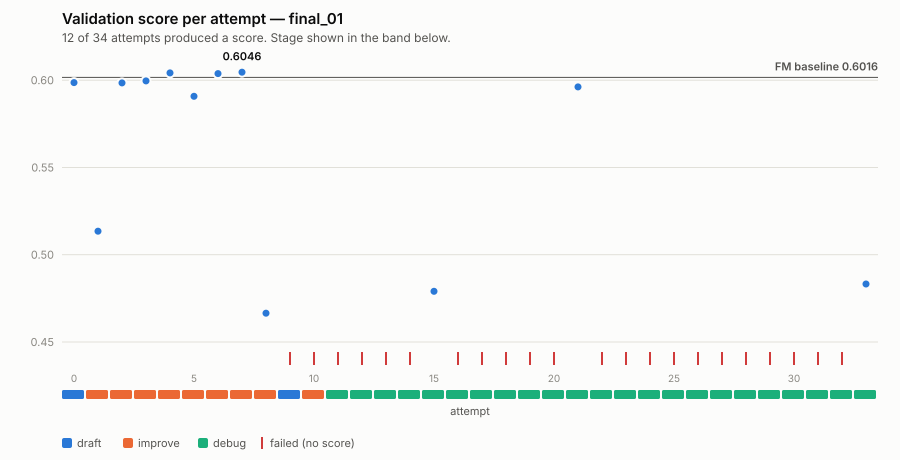
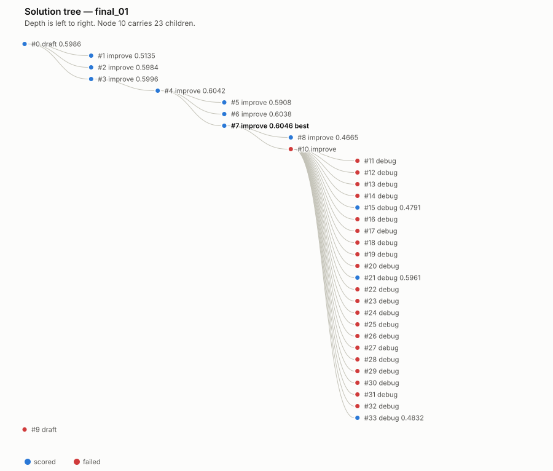
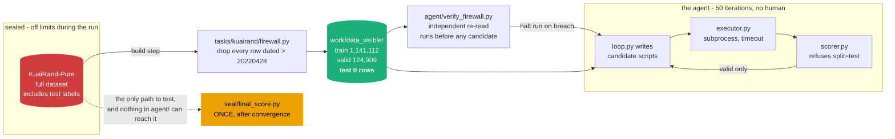

# An autonomous ML research agent

An agent that runs the machine-learning research loop by itself: read the
problem, explore the data, form a hypothesis, write the code, train, evaluate,
read its own stack traces, and try again — with no human in the loop.

It is **task-agnostic**: the same unmodified loop runs on a recommender ranking
benchmark, a synthetic regression problem, or any CSV you point it at. It was
built for **TikTok TechJam Track 2** (solo entry) against the KuaiRand-Pure
within-user ranking benchmark, and that run is what the results below describe.

[](https://github.com/SaanviTondak/ml-research-agent/actions/workflows/tests.yml)

It ran for 58 minutes, wrote 34 candidate models, recovered unaided from 23 of
its own failures, and beat the baseline on a held-out test split it was
structurally prevented from ever reading.

```
Held-out test, scored once      primary = mean(GAUC, nDCG@5)

  random                        0.4757
  item popularity               0.5715
  FM baseline  <- the target    0.5946
  this agent                    0.5983   +0.0037
  oracle ceiling                0.8645
```

**+0.0037** is a small number and worth stating plainly: it is ~1.4% of the
headroom the baseline left below the oracle. The interesting artifact here is
the loop, not the model — including the way it failed, which is documented
rather than trimmed.

> Python 3.9+ and numpy. No torch, no pandas, no sklearn, no GPU.

**Want to run it on your own problem?** Jump to
[It runs on your problem too](#it-runs-on-your-problem-too).

---

## The run

Every attempt the agent made, rendered from its own state file
(`python3 tools/render_charts.py`):

<picture>
  <source media="(prefers-color-scheme: dark)" srcset="docs/img/final_01-attempts-dark.svg">
  
</picture>

| | |
|---|---|
| Iterations | 34 of 50 (stopped on the convergence rule) |
| Wall-clock | 0.97 h of a 6 h cap |
| LLM tokens | 733,802 across 37 calls |
| GPU-hours | 0 |
| Failures recovered from, unaided | 23 |
| **Manual interventions** | **2** — both logged, with reasons, in [`docs/interventions.md`](docs/interventions.md) |

The agent found its own way to the result. Unprompted, it read the pointwise
loss / ranking-metric mismatch in the baseline and moved through BPR → sampled
softmax → listwise softmax over each user's real impression list, then added
video-side categorical features on top. That reasoning chain is in
[`submission/nodes/`](submission/nodes/), which holds all 34 scripts exactly as
the model produced them, and in the live [run log](submission/run_log.md).

### What went wrong

Attempts 9 through 33 produced almost nothing, and the reason is a bug in my
search policy, not bad luck. The loop is a greedy tree search — `draft` opens a
root, `improve` extends the best scored node, `debug` repairs a failed one — and
it had **no limit on debug depth and no path back to a healthy node.** Once
node 10 failed, nodes 11–33 all took `parent = 10`: twenty-three consecutive
repairs of the same broken script, while nodes 4 and 7 sat scored and
unextended the entire time.

<picture>
  <source media="(prefers-color-scheme: dark)" srcset="docs/img/final_01-tree-dark.svg">
  
</picture>

68% of the iteration budget went into that trap. The agent's own diagnosis
("the previous script was cut off at the output token limit") was right 5 times
out of 22 failures; the real distribution was 11 `SyntaxError`, 5 genuine
truncations, 3 NaN outputs, 2 `IndexError`, 1 `ValueError`. It was confidently
misattributing its failures, and I had given it no mechanism to escape.

This is the most useful thing the run produced. It has since been fixed: the
repair budget is capped at 3 attempts per node, candidates are `compile()`d
before a subprocess is spent on them, truncated responses are asked to continue
rather than to shrink, and the debug prompt now leads with the traceback
instead of the model's own previous guess.
[`tests/test_search_policy.py`](tests/test_search_policy.py) rebuilds this exact
tree and asserts the trap cannot recur. Full analysis in
[`docs/postmortem.md`](docs/postmortem.md).

The submitted result predates those fixes and stands as scored; the tag
`hackathon-submission` marks the tree it came from.

**A second autonomous run, `final_02`, tested the fix.** It never entered
`debug` - 12 of 12 attempts scored, the worst lineage spent 3 iterations on one
parent, and it converged in a quarter of the tokens. Its validation and sealed
test scores land slightly *below* `final_01`'s, though: the fix demonstrably
buys search efficiency, not automatically a better model, on a floor of only
12 attempts. Full numbers, both trees, and a second finding (a gap in the
seed-verification trigger) in
[`docs/final_02_results.md`](docs/final_02_results.md).

**And a second defect, underneath the first.** `select_parent()` took a global
argmax, so `improve` only ever extended the single best node — a new direction
survived only if it won on its very first scored attempt. `final_02` is the
proof both ways: node 5 (multi-task supervision plus censored watch-time)
cleared the threshold by 0.0025, took the incumbency and became the entire rest
of the run, while the lineage it displaced was abandoned on the spot and never
touched again. The unit of greed is now a *lineage*: a new root gets three
scored attempts on its own branch before it has to compete, convergence is
blocked while an exploration is in budget, and the convergence floor counts
exploit attempts only so buying an exploration never brings the stopping rule
closer. Replaying both recorded trees through the new policy changes 20 of
`final_01`'s 34 selections and **none** of `final_02`'s — the fix is insurance
against the case where the draft doesn't get lucky, which is the case the
tests pin. Its honest limit is in
[`docs/postmortem.md`](docs/postmortem.md#deliberately-not-done): protection is
root-scoped, so the two DIN-style attempts that lost by 0.0004 and 0.0014 —
both `improve` nodes, both inside 2σ of a single-seed incumbent — still would
not have been rescued.

### What was submitted

Node 4, at validation 0.6042 — **not** node 7, which scored 0.6046. Node 7 had
one seed; node 4 was re-run on three (0.6043 / 0.6045 / 0.6038). The 0.0004 gap
between them is half this benchmark's seed-to-seed noise of 0.0008, so shipping
the higher unverified number would have been chasing luck. Selection rule:
validation-best at convergence, seed-verified — never the running peak.

---

## The test-split firewall

**KuaiRand-Pure ships the test labels in the public download, and the
organizers' `baseline.py` reads them.** The hidden test set is hidden by
convention only.

For a human entrant that is a mild hazard. For an autonomous agent writing and
running its own code across 50 iterations it is fatal: one candidate that
selects on test — deliberately, or by copying the pattern out of `baseline.py` —
silently invalidates every number the project reports, and nothing about the run
would look wrong.

So the constraint is structural, not procedural.



[`tasks/kuairand/firewall.py`](tasks/kuairand/firewall.py) materialises `work/data_visible/`, a
data directory that **physically contains no impression dated after 20220428**,
the last day of the validation window:

```
log_standard_4_08_to_4_21_pure.csv   kept 1,141,112   dropped       0
log_standard_4_22_to_5_08_pure.csv   kept   124,909   dropped 170,588
log_random_4_22_to_5_08_pure.csv     kept   288,338   dropped 897,721
```

The row counts match the organizers' published split sizes exactly, which is
itself a check that the date filter is right.

The directory keeps the organizers' filenames and column layout, so the
untouched starter kit works against it verbatim — it simply reports `test = 0
rows`. The agent calls `data.load()` exactly as documented and still cannot
reach a single test label, because they are not on disk anywhere it can see.

[`agent/verify_firewall.py`](agent/verify_firewall.py) is a **second,
independent implementation** of the check. It does not trust the manifest; it
re-reads every written row, asserts the date bound directly, then confirms the
organizers' own loader returns an empty test split. It runs before any candidate
executes, so a breach halts the run.

Three more controls sit behind it: the scorer refuses `split="test"` without an
explicit seal token; `evaluate.py` is checksummed before every scoring call, so
a candidate that "improves" by rewriting the metric fails loudly; and the sealed
scorer refuses to overwrite an existing result without `--force`, making any
re-run visible in the audit trail. Test scoring happened **once**, from
[`seal/final_score.py`](seal/final_score.py), after the run had converged.

Full rationale, including one residual risk that was accepted rather than
hidden, is in [`docs/firewall.md`](docs/firewall.md).

---

## The benchmark

For each user, order the videos they were actually shown. Relevance is the
native `long_view` column. Scoring is `mean(GAUC, nDCG@5)` over within-user
rankings, defined entirely by the organizers'
[`evaluate.py`](kuairand-starter-kit/evaluate.py), which is never modified.

Two properties dominate the design:

**The lists are short.** A typical user has 4–5 impressions in the evaluation
window; 55% of validation users have fewer than five. `nDCG@5` is therefore
close to full-list nDCG for most users, and a listwise objective over a user's
actual impression list is both metric-aligned and computationally free.

**A third of users are unrankable.** 27.1% of test users viewed nothing for
long and 9.2% viewed everything — no ordering changes their score, and GAUC
excludes them entirely. A model that cheats by reading the labels scores
0.8645, not 1.0. Progress should be judged against that ceiling.

The organizers measured two directions as dead ends: adding all 13 feature
fields (0.5940 vs 0.5950) and raising embedding dimension (flat across
k = 8/16/32). Capacity and static features are not the bottleneck. The loss
function is — the baseline optimises pointwise logloss but is scored on ranking,
and the Phase 0 training trace shows them come apart directly:

| epoch | train logloss | valid primary |
|---|---|---|
| 5 | 0.4941 | 0.6010 |
| **7** | 0.4859 | **0.6015** ← best |
| 9 | 0.4784 | 0.6007 |
| 11 | 0.4705 | 0.5990 |

After epoch 7 the model keeps improving at what it optimises and degrades at
what it is judged on. **This was deliberately withheld from the agent.** Ranking
the open directions was its job, and it got there on its own by attempt 2.

---

## The candidate contract

Every candidate — the reference one and every script the agent writes — is a
standalone program:

```bash
python3 <candidate>.py --data_dir DIR --split {train,valid,test} --out FILE
```

It reads only from `--data_dir`, trains on train, selects on valid, and writes
`row_id,user_id,video_id,score` for `--split` in exactly the row order of
`data.load(data_dir)[split]`.

Alignment is checked row by row before scoring. The submission format is
positional because `(user_id, video_id)` is **not** a key — the test split
contains 3.06% duplicate pairs. A candidate that sorted its output would
otherwise score like noise and be indistinguishable from a bad idea.

`--split` is a parameter from the very first candidate so that the winning
script needs **no edits** between validation-selection and the sealed test run.
An edit at that boundary is exactly where a leak would hide.

---

## It runs on your problem too

The agent knows nothing about recommendation. `agent/state.py`, `agent/llm.py`
and `agent/executor.py` contain **no benchmark-specific code** — the only
mentions of KuaiRand anywhere in them are two docstrings citing it as the
example that motivated a design choice. A task is a directory implementing
[`agent/task.py`](agent/task.py), and the interface is just the set of calls
the loop already made.

| task | metric | direction | structure | submission |
|---|---|---|---|---|
| [`tasks/kuairand/`](tasks/kuairand/) | mean(GAUC, nDCG@5) | maximise | per-user groups | 4 columns |
| [`tasks/tabular/`](tasks/tabular/) | rmse · mae · logloss · auc · accuracy | either | per-row | 2 columns |
| [`tasks/synthetic/`](tasks/synthetic/) | RMSE | minimise | per-row | 2 columns |

### Bring your own CSV — no code required

Put `train.csv`, `valid.csv` and `test.csv` in a directory, each with a header
row and a target column:

```bash
python3 -m agent.loop --task tabular \
    --data ./mydata --target churn --metric auc
```

That is the whole setup. It builds the firewall for you — the held-out target
column is **removed from the file on disk**, not masked — writes a briefing from
your own column names, fits a linear reference for the agent to beat, and
enforces the submission contract. Numeric and categorical columns and missing
values are all handled; get a flag wrong and you get a sentence, not a
traceback.

### Why it can travel: it measures the noise before it searches

Portability is not a refactor. Every decision threshold in the search was
silently denominated in one benchmark's noise floor — `VERIFY_MARGIN = 0.0008`
*was* KuaiRand's seed sigma. On a task where sigma is 0.05 that agent verifies
on every node and never converges.

[`agent/calibrate.py`](agent/calibrate.py) now runs the task's own reference
implementation on k seeds before the first search step, measures the noise, and
derives the thresholds from it. Fed only measurements, it regenerates the
constants that were tuned by hand over two real runs:

| constant | hand-tuned | derived from measurement |
|---|---|---|
| `VERIFY_MARGIN` | 0.0008 | **0.000774** |
| `EPS` | 0.002 (organizers') | **0.00195** |
| `PROTECTION_WRITE_OFF` | 0.006 | **0.006000** |

It separates two noise sources the original policy conflated, and that turned
up something about the benchmark it was tuned for: **evaluation-set noise
(0.00070) is the same size as seed noise (0.00063), and the policy had only
ever been looking at one of them.** A one-seed-vs-one-seed comparison between
two designs carries about twice the noise every threshold assumed.

Guard rails, because this is the part that can quietly go wrong:

- a **declared** epsilon — a competition's stated stopping rule — is reported
  in sigma but never overruled;
- a **deterministic** task gets finite thresholds *and* has seed verification
  switched off entirely, because re-running returns the identical number;
- a **discrete** metric never gets a threshold finer than one grid step;
- a missing, broken or too-slow reference **skips** calibration, keeps the
  declared constants, and says so in the run log.

Full detail, including the honest limits, in
[`docs/generalization.md`](docs/generalization.md).

---

## Repository layout

```
agent/                  the agent. no benchmark knowledge lives here.
  loop.py             the search: draft / improve / debug over a solution tree
  state.py            the solution journal (the tree) + the search policy
  task.py             what a task must provide; the generic Score
  calibrate.py        measures the task's noise floor, derives the thresholds
  llm.py              model client, failover chain, token accounting
  executor.py         runs untrusted candidate code under a hard timeout
  guard.py            static check on generated code before it executes
  journal.py          append-only JSONL run log, fsync per event
  prompts.py          the shared prompt templates each task fills in
  scorer.py           submission-contract validation
  registry.py         builds a task from command-line arguments
  paths.py            canonical paths; the sealed directory named in one place
  verify_firewall.py  independent re-verification of the KuaiRand firewall
tasks/                  everything benchmark-specific
  kuairand/           the TechJam benchmark: briefing, date-based firewall
  tabular/            bring your own CSV: metrics, reference, firewall
  synthetic/          a task whose noise floor is a knob, for calibration tests
candidates/
  fm_baseline.py      candidate 0: the organizers' FM, in the contract
  agent_best.py       the submitted model, as the agent wrote it
seal/
  final_score.py      SEALED — the only script permitted to read test
submission/
  nodes/              all 34 agent-written scripts + diffs, with an index
  run_log.md          the live run log
  journal.jsonl       the raw event stream
  results.md          every attempt, and the sealed test result
tests/                113 tests; no dataset and no API key required
tools/                preflight and rendering utilities
kuairand-starter-kit/ the organizers' code, unmodified
harness_check.py      9 end-to-end checks against the real dataset
docs/
  generalization.md   the Task interface and the calibration, with its limits
  postmortem.md       the search-policy defects, and how they were found
  final_02_results.md the second run, and what it did and did not prove
  firewall.md         the leak-prevention design
  interventions.md    the honest autonomy record
  phase0_baseline_repro.md
```

`work/` holds regenerable artifacts and is gitignored; the dataset is never
committed.

---

## Quickstart

```bash
pip install numpy pytest
python3 -m pytest tests/            # 113 tests, no dataset, no API key, ~40 s
```

The suite runs the whole loop end to end against the synthetic task with a
stubbed model, so the draft/improve/debug state machine, convergence and the
calibration are all covered without a dataset or a key.

### On your own data

```bash
python3 -m agent.loop --task tabular \
    --data ./mydata --target churn --metric auc
```

Needs a model API key (below), and `mydata/` containing `train.csv` and
`valid.csv` with a header row. `test.csv` is optional; if present, its target
column is stripped on the way in.

### On the TechJam benchmark

With the dataset in place:

```bash
# Place KuaiRand-Pure under kuairand-starter-kit/KuaiRand-Pure/data/
python3 -m tasks.kuairand.firewall  # build the agent's view of the data
python3 -m agent.verify_firewall    # prove it contains no test rows
python3 harness_check.py            # 9 checks end to end (~45 s)
```

`harness_check.py` needs no API key. It pushes the organizers' own FM through
the complete pipeline — executor, contract, scorer, journal — against the
firewalled directory and asserts it comes back out at the published baseline:

```
[1. evaluate.py unmodified]                    PASS
[2. firewall built and clean]                  PASS   train=1,141,112 valid=124,909 test=0
[3. candidate 0 runs under the executor]       PASS   ok in 29.1s
[4. output satisfies the submission contract]  PASS   124,909 rows aligned
[5. reproduces the published baseline]         PASS   primary 0.6015, delta -0.0000
[6. executor survives a crashing candidate]    PASS   ValueError caught, loop continued
[7. executor kills a hanging candidate]        PASS   TIMEOUT after 5.1s
[8. scorer rejects a misaligned submission]    PASS
[9. scorer refuses the test split]             PASS
```

Checks 6 and 7 inject a crash and a hang deliberately. The hang test spawns a
*grandchild* process specifically because a plain `kill()` would leave it
running and hold the output pipe open forever — the most common way an
unattended loop dies silently. The executor kills the whole process group.

To run the agent itself you need a Gemini API key in `.env`:

```bash
python3 tools/check_llm.py          # verify the key, endpoint and failover chain
python3 -m agent.loop --run_dir work/runs/my_run           # KuaiRand (default)
python3 -m agent.loop --task tabular --data ./mydata \
    --target churn --metric auc                            # your own CSV
python3 -m agent.loop --help                               # all tasks and flags
```

The model client sits behind a swappable `Backend` interface
([`agent/llm.py`](agent/llm.py)); Gemini is the one implementation shipped.

---

## Attribution

`kuairand-starter-kit/` is the organizers' code, committed pristine and
unmodified; `evaluate.py` is checksummed to prove it stayed that way. The
dataset is [KuaiRand](https://kuairand.com) (Gao et al.), used under its
published licence and never redistributed here. No external training data is
used — KuaiRand only. Project code is MIT licensed; see [LICENSE](LICENSE).
