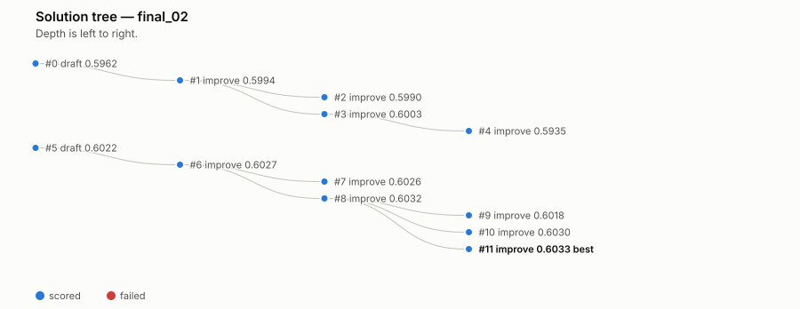

# `final_02`: does the search-policy fix actually help?

`final_01` is the hackathon submission, frozen at tag `hackathon-submission`.
[`docs/postmortem.md`](postmortem.md) found that 68% of its iteration budget
was lost to a single broken node that the search had no way to leave. Four
fixes were made afterward (repair-budget cap, a syntax pre-check, a saner
response to output truncation, and a reordered debug prompt) and verified
against a replay of that exact failure in
[`tests/test_search_policy.py`](../tests/test_search_policy.py).

`final_02` is a second autonomous run under the fixed loop, same benchmark,
same caps, same convergence rule — asking the only question that matters:
does the fix change what the agent actually finds, or only how cleanly it
gets there?

**Short answer: the search got much better. The model it found did not.**

## The numbers

| | `final_01` (submitted) | `final_02` |
|---|---|---|
| attempts | 34 | 12 |
| scored | 12 (35%) | 12 (**100%**) |
| iterations in `debug` | 23 (**68%**) | 0 (**0%**) |
| most attempts spent on one parent | 23 (node 10) | 3 (node 8) |
| stopped by | convergence | convergence |
| validation primary, 3-seed verified | 0.6042 (node 4) | 0.6036 (node 11) |
| **sealed test primary** | **0.5983** | **0.5968** |
| test seeds | 1 (0.6047 dead) | 3, mean +/- 0.0006 |
| delta vs. FM baseline (0.5946) | **+0.0037** | **+0.0022** |
| fraction of headroom to oracle (0.8645) | +1.4% | +0.8% |
| LLM tokens | 733,802 | 338,950 |
| wall-clock | 0.97 h | 4.04 h (~2h host-sleep-inflated, see below) |

Every number above is read from each run's own `state.json` / journal or its
sealed `final_result.json` — reproduce the process comparison with
`python3 tools/compare_runs.py final_01 final_02`.

## What the fix demonstrably did

`final_02` never entered `debug`. Every one of its 12 attempts produced a
score - the reference implementation's own hit rate on this benchmark. The
worst-behaved lineage spent 3 iterations on one parent (node 8, all
`improve`), nowhere near a runaway chain. This is the search-policy fix
working exactly as intended:

Compare the shape of `final_01`'s tree - the 23-node fan off node 10 - in the
[main README](../README.md#the-run) or [`postmortem.md`](postmortem.md).

## What the fix did not do

`final_02`'s validation and test scores both land a little *below*
`final_01`'s. This is not the fix failing; it is the fix doing exactly what it
promises (spend the budget on useful search) while the *content* of what the
model tries is still generated by the same LLM prompted the same way, on the
same 12-scored-attempt floor. `final_01`'s submitted node happened to land on
a slightly better cross-feature combination; `final_02`'s search, run cleanly
end to end, still converged on marginally lower ground. Twelve genuinely
distinct, well-explored attempts is a small sample, and this comparison is
n=2 runs - exactly the situation the benchmark's own seed-verification
discipline exists to guard against over-reading.

One asymmetry favors `final_02`'s number being the more trustworthy of the
two: `final_01`'s sealed test score is a **single seed** (its own audit trail
records the other two seeds were abandoned for the deadline), while
`final_02`'s is a proper 3-seed mean with std 0.0006. If anything, `final_01`'s
+0.0037 is the less-verified claim of the pair.

## A second finding, from this run alone

`final_02`'s reported best (node 11, single-seed 0.6033) was never actually
re-verified against multiple seeds during the run. The promotion check only
re-verifies a candidate that beats the incumbent by more than `EPS=0.002`;
nodes 6 through 11 each advanced the best by less than that individually
(+0.0005, -0.0001, +0.0005, -0.0014, -0.0002, +0.0001), so none tripped it,
even though they compound. The last node the loop *did* 3-seed verify was
node 5, at 0.6022 +/- 0.0005 - six unverified steps behind by the time the run
stopped.

Manually verifying node 11 after the run found it holds up: 0.6033 / 0.6040 /
0.6036 across seeds 0-2, mean **0.6036 +/- 0.0004**, a genuine +0.0014 over
node 5. This run was not harmed by the gap. But the mechanism that let it
through is real and is not guaranteed to land on solid ground next time -
logged in [`postmortem.md`](postmortem.md) under "Not done."

## The sleep event

The host slept for roughly two hours partway through this run (documented in
[`interventions.md`](interventions.md)); `caffeinate` was attached once
noticed and no further sleep occurred. `final_02`'s wall-clock and one
individual candidate's reported runtime are inflated by that gap and are not
comparable to `final_01`'s timing. Attempt count, scoring rate, debug share,
and every validation/test score are unaffected - none of them depend on
wall-clock.

## Conclusion

The search-policy fix is validated: it eliminated the debug trap entirely, on
the first run it was tested against, using less than half the tokens. Whether
it also finds *better* models is a separate question this single comparison
cannot answer either way, and the honest data point here is that it did not,
this time. A fair test of that second question needs several runs per policy,
not one - noted as future work rather than claimed as a result.
